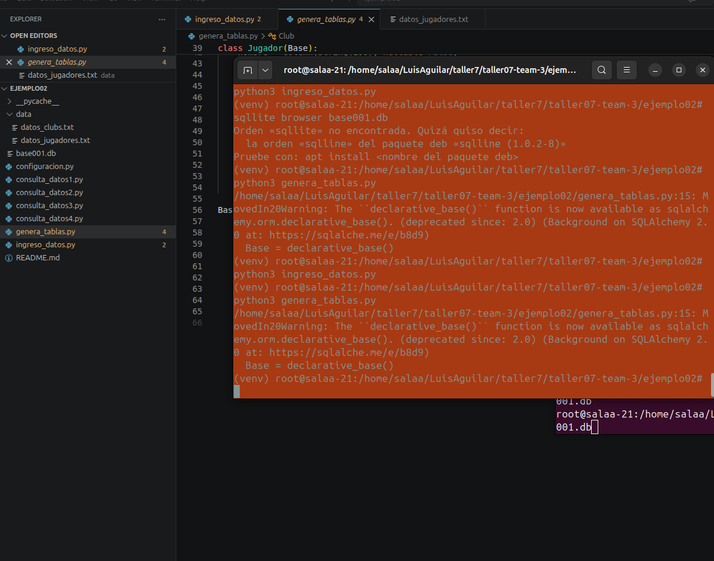
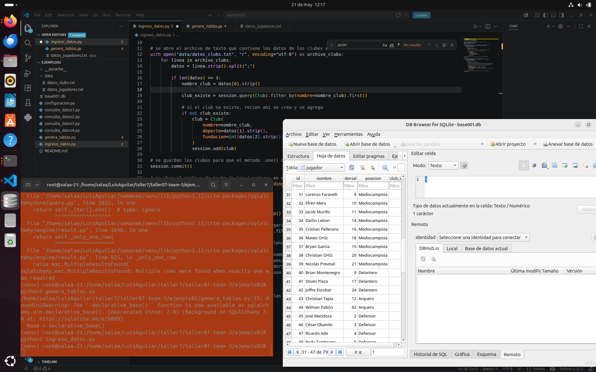
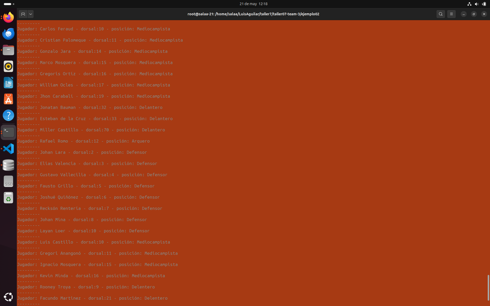
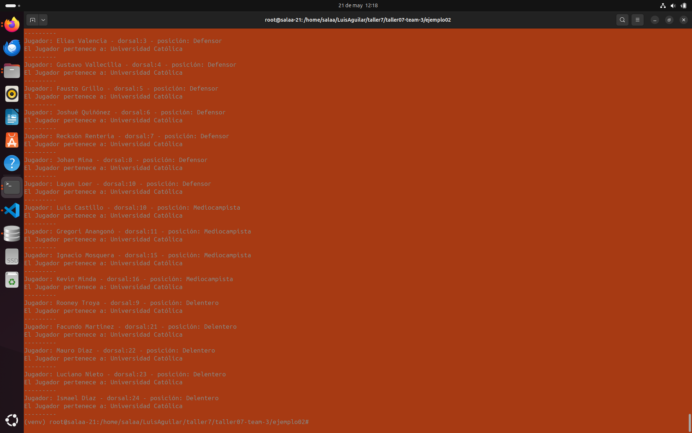
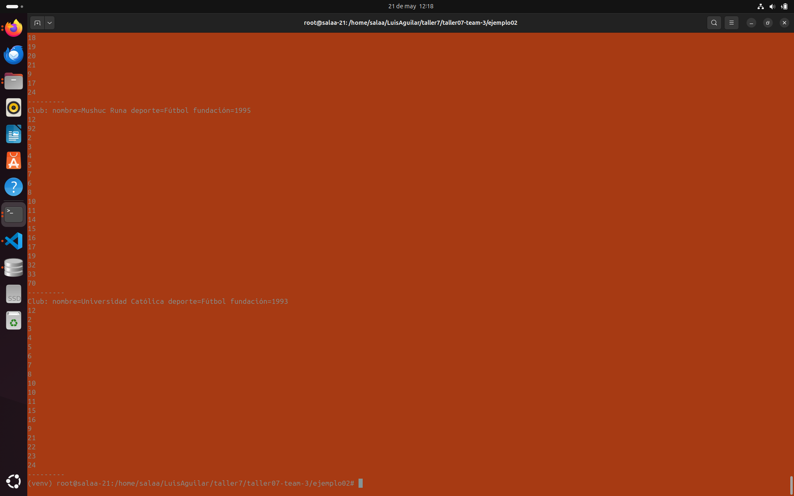
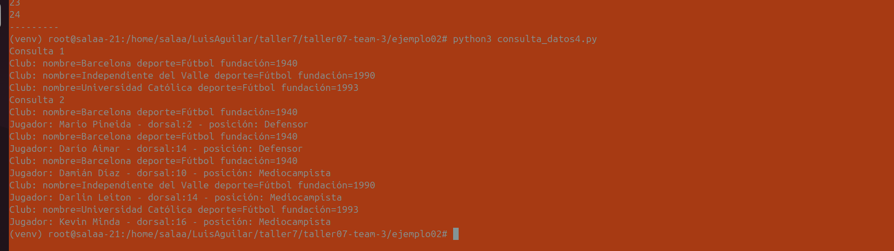

## Actividad

* Realizar las actividades descritas en el README de la carpeta **ejemplo02**


# Evidencias de Taller: Persistencia de Datos con SQLAlchemy

Este repositorio contiene la solución a las actividades del taller práctico sobre el manejo de bases de datos relacionales utilizando Python y SQLAlchemy ORM.

## Actividades Realizadas

1. **Migración de Archivos Base:** Se copiaron los archivos de configuración y consulta desde la carpeta `ejemplo01`.
2. **Desarrollo de `ingreso_datos.py`:** Creación del script para leer de forma dinámica los archivos de texto plano dentro de la carpeta `data` (`datos_clubs.txt` y `datos_jugadores.txt`) e insertar los registros en las entidades **Club** y **Jugador**.

---

##  Orden de Ejecución y Evidencias

### 1. Generación de Tablas
Crea la estructura de la base de datos basada en los modelos definidos.
```bash
python3 genera_tablas.py
```


### 2.Ingreso de Datos
Pobla las tablas Club y Jugador procesando los archivos .txt de la carpeta data.
```bash
python3 ingreso_datos.py
```


### 3. Ejecución de Consultas de Datos
Validación de la información almacenada en el sistema mediante los scripts de consulta previstos.

### Consulta 1
```bash
python3 consulta_datos1.py
```


### Consulta 2
```bash
python3 consulta_datos2.py
```


### Consulta 3
```bash
python3 consulta_datos3.py
```


### Consulta 4
```bash
python3 consulta_datos4.py
```

